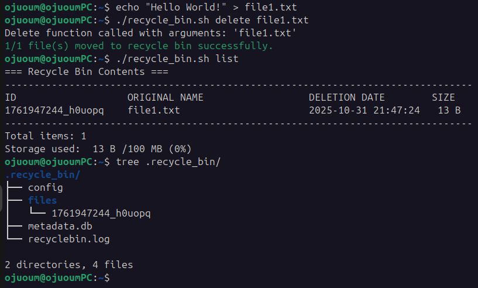

# Manual Testing
## Test Case 1: Delete Single File 
 
**Objective:** Verify that a single file can be deleted successfully 
 
**Steps:** 
1. Create test file: `echo "Hello World!" > file1.txt` 
2. Run: `./recycle_bin.sh delete file1.txt` 
3. Verify file is removed from current directory 
4. Run: `./recycle_bin.sh list` 
5. Verify file appears in recycle bin 
6. Run: `tree .recycle_bin/`
 
**Expected Result:** 
- File is moved to ~/.recycle_bin/files/ 
- Metadata entry is created 
- Success message is displayed 
- File appears in list output 
 
**Actual Result:**
- Check screenshots
 
**Status:** Pass
 
**Screenshots:**

## Test Case 2: Delete Multiple Files
 
**Objective:** Verify that multiple files can be deleted successfully 
 
**Steps:** 
1. Create test file: `echo "test" > file2.txt` 
2. Create other test file: `echo "other test" > file3.txt` 
3. Create another test file: `echo "another test" > file4.txt` 
4. Run: `./recycle_bin.sh delete test.txt` 
5. Verify files are removed from current directory
6. Run: `./recycle_bin.sh list` 
7. Verify files appear in recycle bin 
8. Run: `tree .recycle_bin/`
9. Verify bin files content
9. Run: `cat .recycle_bin/metadata.db`
10. Run: `cat .recycle_bin/config`
11. Run: `cat .recycle_bin/recyclebin.log`
 
**Expected Result:** 
- Files are moved to ~/.recycle_bin/files/ 
- Metadata entries are created 
- Success message is displayed 
- Files appear in list output 
- Log entries are created
 
**Actual Result:**
- Check screenshots
 
**Status:** Pass
 
**Screenshots:**

## Test Case 3: Restore File
 
**Objective:** Verify that a file can be restored by ID
 
**Steps:** 
1. After having deleted at least one file
2. Check available file IDs
3. Run: `./recycle_bin.sh list`
4. Restore a file by ID
5. Run: `./recycle_bin.sh restore <valid_id>`
6. Check if file is still in recycle bin
7. Run: `./recycle_bin.sh list`

**Expected Result:** 
- List command shows available IDs
- File is restored
- Success message is displayed
- File is no longer in recycle bin
 
**Actual Result:**
- Check screenshots
 
**Status:** Pass
 
**Screenshots:**

## Test Case 4: Detailed list 
 
**Objective:** Show detailed list of deleted files
 
**Steps:** 
1. After having deleted at least one file
2. Run: `./recycle_bin.sh list --detailed`

**Expected Result:** 
- Detailed list command shows detailed file information
 
**Actual Result:**
- Check screenshots
 
**Status:** Pass
 
**Screenshots:**

# Automatic Testing
***`test_suite.sh` provides a series of automated tests***  
All tests run are passing

### Run `./test_suite.sh` to execute tests

### Run `./test_suite.sh -v` to execute tests and check intermediate messages echoed by the main functions

